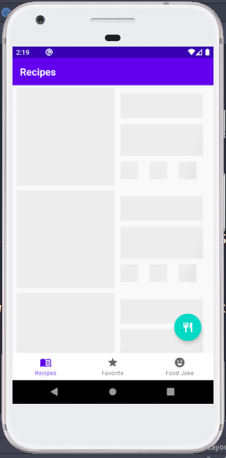

# Foods app with Android jetpack

These is demo project used to explaining Android architecture with libraries like

- Live data, View Model, View Model Factory
- Navigation component
- Retrofit, Okhttp, Gson
- Room
- kotlin coroutines
- Dependency injection with hilt(dagger)
- MVVM design pattern
- Recycler view with DiffUtil
- Glide
- And more

## Workshop example 1

